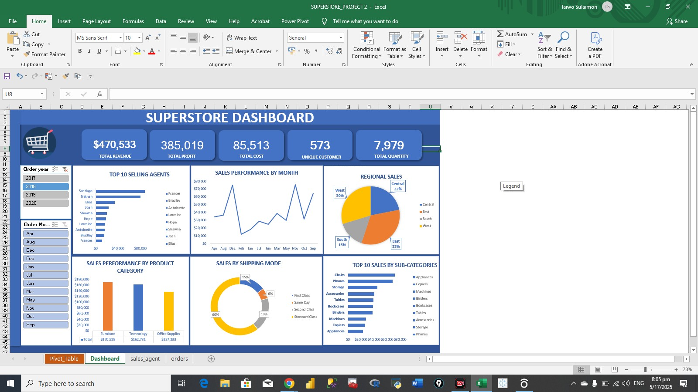

# Superstore Data Analysis
### Table of Content
* [Project Overview](#project-overview)
* [Data Source](#data-source)
* [Problem Statements](#problem-statement)
* [Project Objectives](#project-objectives)
* [Tools Used](#tools-used)
* [Datasets](#datasets)
* [Key Insights](#key-insights)
* [Results/Findings](#result--findings)
* [Recommendations](#recommendations)

### Project Overview
This project features a dynamic Excel dashboard built to analyze and visualize sales performance using real-world Superstore dataset. The datasets helps track KPIs, monitor trends, and uncover insights for data-driven business decisions.

### 📸 Dashboard Preview

### Data Source
Superstore data: The primary dataset used for this analysis is the "superstore_data.csv" file, containing detailed informationabout each sale made by the company.
### Problem Statement
This project will address several critical questions related to top selling agents, and sales performance by product categories.
* What are the top 10 selling agents?
* Which region as the highest sales?
* Which category generated the most sales?
* What are the top 10 product sub-categories?
* Which shipping mode as the highest sales?
* Which has the highest sales performance in a month for each year( 2017-2020 )?
### Project Objectives
* Create a sales performance dashboard using Excel.

* Analyze sales performance by product category, and sub-category.

* Identify top-performing agents and Regional sales.

* Identify the KPI cards ( Total revenue, Total order id and Unique customer).
### Tools Used
* Microsoft Excel
  * PivotTables
  * Slicers (Order Year & Month)
  * Line, Bar, Pie, and Donut Charts
  * Conditional Formatting
  * Dashboard Design & Layout
### Datasets
Fictional Superstore sales data including:
* Order ID
* Sales Amount
* Cost
* Profit
* Quantity
* Customer ID
* Region
* Product Category & Sub-category
* Sales Agent
* Shipping Mode
* Order Month & Year
### Key Insights
* KPI Cards
  * Total Revenue: $1,723,652
  * Total Orders: 7,385
  * Unique Customers: 786
  * Total Quantity: 27,975
  * Total Cost: $323,419
  * Total Profit: $1,400,233

* Top 10 Selling Agents

  The analysis of sales data revealed the top 10 sales agents who made the highest contributions in terms of total revenue generated from product sales.
  Santiago emerged as the top-performing agent with total sales of $343,443, leading significantly ahead of the others. He was followed by Nathan, who    achieved $224,137 in total sales, and Elias, with $139,953. These three agents stand out for their remarkable sales performance and could serve as     key examples in future performance reviews or internal training programs.

  Further down the list, Joan recorded $94,304, while Shawna followed closely with $82,020. Bradley, Bruce, and Lorraine also performed well,   contributing over $60,000 each to the company's revenue. Finally, Hope and Antoinette round out the top 10 with solid sales figures of $62,619 and $60,293, respectively.

  This breakdown not only highlights individual performance but also gives insights into potential team leadership, coaching opportunities, and areas   for replicating successful sales strategies.

* Sales Performance by Month (Line Chart)
  *	Strongest sales in December, November, and September.
  * Insight: Indicates seasonal spikes; great for planning sales promotions.

* Regional Sales (Pie Chart)
  *	West leads with 31%, followed by East (29%) and Central (23%).
  *	Insight: West, East, and Central are key regions; marketing can focus on expanding this three regions.

* Sales Performance by Product Category
  * The product categories by total sales are Technology ($632,915), Furniture ($559,402), and Office Supplies ($531,254).
  * Insights:
    * Technology leads as the highest revenue-generating category, indicating strong customer demand and potential.
    * Furniture ranks second, showing consistent performance.
    * Office Supplies maintains steady sales.

### Results/Findings
2017–2019 Sales Performance
* Consistent and strong sales across all months.
* Noticeable monthly growth trend year over year.
* Indicates stable business operations and demand.

2020 Sales Performance
* Significant decline in sales activity.
* Sales occurred in only 4 out of 12 months.
* Suggests disruption or reduced market activity during the year.

 Overall Yearly Performance
* Technology emerged as the top-performing product category throughout 2017 to 2020.
* In 2018, there was a surprising spike in Furniture sales, temporarily outperforming Technology for that year.

Shipping mode status
* Standard Class dominates with over 50% of total shipments, indicating it's the most preferred delivery option by customers.

### Recommendations
Based on the analysis, we recommend the following actions:
* Invest more in Technology category during peak sales seasons to maximize revenue.
* Focus on expanding and optimizing Standard Class shipping — improve efficiency, negotiate better logistics deals, and consider promotional bundles to further enhance customer satisfaction and cost-effectiveness.
* Increase investment in Furniture category, considering its strong performance in 2018 and its potential for future growth

   

---

## 👨‍💻 Author
**Taiwo Sulaimon**  
Certified Data Analyst | Excel | SQL | Power BI | Python  
[LinkedIn](https://www.linkedin.com/in/taiwo-sulaimon-2b85a72b6) | [GitHub](https://github.com/tweinstein01)

  

  
